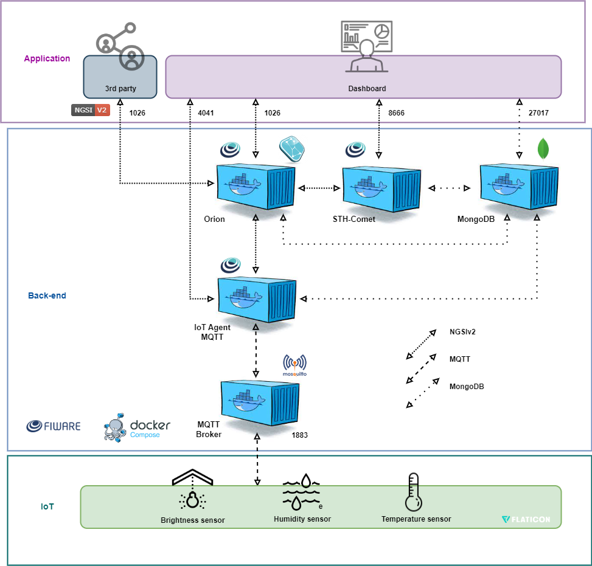

# CP5 - Computação de Borda com IoT para Monitoramento de Vinhedos

Este projeto faz parte do **Check Point 5** de IoT. O foco está no monitoramento de vinhedos usando dispositivos IoT conectados a um dashboard web dinâmico para análise de dados em tempo real, aproveitando a Computação de Borda e o FIWARE.

## Visão Geral do Projeto

O sistema utiliza um **ESP32** conectado a múltiplos sensores para monitoramento de temperatura, umidade e luminosidade, simulando as condições do vinhedo. Um buzzer é ativado quando o ambiente sai das faixas pré-estabelecidas para temperatura, umidade e luminosidade.

O dashboard, desenvolvido em Python, exibe dinamicamente os dados históricos coletados pelos sensores, oferecendo aos gerentes de vinhedos uma visão abrangente do ambiente.

### Funcionalidades
- **Monitoramento em tempo real** de temperatura, umidade e luminosidade.
- **Sistema de alerta automático** via buzzer para condições críticas.
- **Dashboard web** para análise de dados históricos.
- **Simulação usando Wokwi** para prototipagem da solução.

## Estrutura do Projeto

- **FiwareDeploy_new_v4.drawio**: Diagrama de arquitetura da solução.
- **cp5-Edge.drawio.png**: Representação gráfica da arquitetura do sistema.
- **dashboard.py**: Script Python para o dashboard web dinâmico.
- **wokwi-img.PNG**: Captura de tela da simulação configurada no Wokwi.
- **wokwi.c++**: Código para configuração do ESP32 com os sensores conectados.

 ## Arquitetura


## Instalação

### Pré-requisitos
- ESP32
- Sensor DHT22 (temperatura e umidade)
- Sensor LDR (luminosidade)
- Buzzer
- Simulador Wokwi

### Passos

1. **Clonar o repositório**:
   ```bash
   git clone https://github.com/seu-repositorio/cp5-Edge.git
   cd cp5-Edge

2. **Executar o dashboard**:
   ```bash
   python3 dashboard.py
   
3. **Simular com o Wokwi**:
   Abra o arquivo wokwi.c++ no simulador Wokwi para simular o ambiente com os sensores.

## Como Funciona

- Sensores: O DHT22 mede temperatura e umidade, enquanto o LDR monitora a luminosidade. Todos os dados são enviados para o ESP32.
- Buzzer: É ativado se:

A temperatura estiver abaixo de 14°C ou acima de 17°C. | A umidade estiver abaixo de 60% ou acima de 80%. | A luminosidade estiver abaixo de 50 ou acima de 100.

- Dashboard: Exibe dados em tempo real e tendências históricas dos sensores. O dashboard é atualizado dinamicamente para ajudar na tomada de decisões em tempo real e também exibe gráficos históricos.

## Integrantes
- Arthur Galvão Alves - RM554462
- Eduardo da Silva Lima - RM554804
- Felipe Braunstein e Silva - RM554483
- Felipe do Nascimento Fernandes - RM554598
- Jefferson Junior Alvarez Urbina - RM558497

